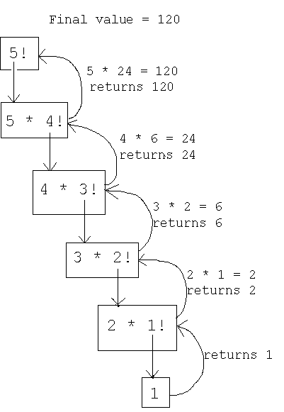

      Recursion 

What is Recursion?
There are two main instances of recursion. The first is when recursion is used as a technique in which a function makes one or more calls to itself. The second is when a data structure uses smaller instances of the exact same type of data structure when it represents itself. Both of these instances are use cases of recursion.

Recursion actually occurs in the real world, such as fractal patterns seen in plants!

use case of Recursion:

Recursion provides a powerful alternative for performing repetitions of tasks in which a loop is not ideal. Most modern programming languages support recursion and recursion serves as a great tool for building out particular data structures.

1.factorial_recursion.py

Factorial Example:
 The factorial function is denoted with an exclamation point and is defined as the product of the integers from 1 to n. Formally, we can state this as:

Note, if n = 0, then n! = 1. This is important to take into account, because it will serve as our base case.

Take this example:
So how can we state this in a recursive manner? This is where the concept of base case comes in.

Base case is a key part of understanding recursion, especially when it comes to having to solve interview problems dealing with recursion. Let's rewrite the above equation of 4! so it looks like this:

Notice that this is the same as:

Meaning we can rewrite the formal recursion definition in terms of recursion like so:

Note, if n = 0, then n! = 1. This means the base case occurs once n=0, the recursive cases are defined in the equation above. Whenever you are trying to develop a recursive solution it is very important to think about the base case, as your solution will need to return the base case once all the recursive cases have been worked through. Let's look at how we can create the factorial function in Python:

base case is 

# BASE CASE!
    if n == 0:
        return 1
# Recursion!
    else:
        return n * fact(n-1)

can see whole code in 1.factorial_recursion.py file

<!-- http://faculty.cs.niu.edu/~freedman/241/241notes/recur.gif -->

# Conclusion:
Recursion is a powerful tool, but it can be a tricky concept to implement